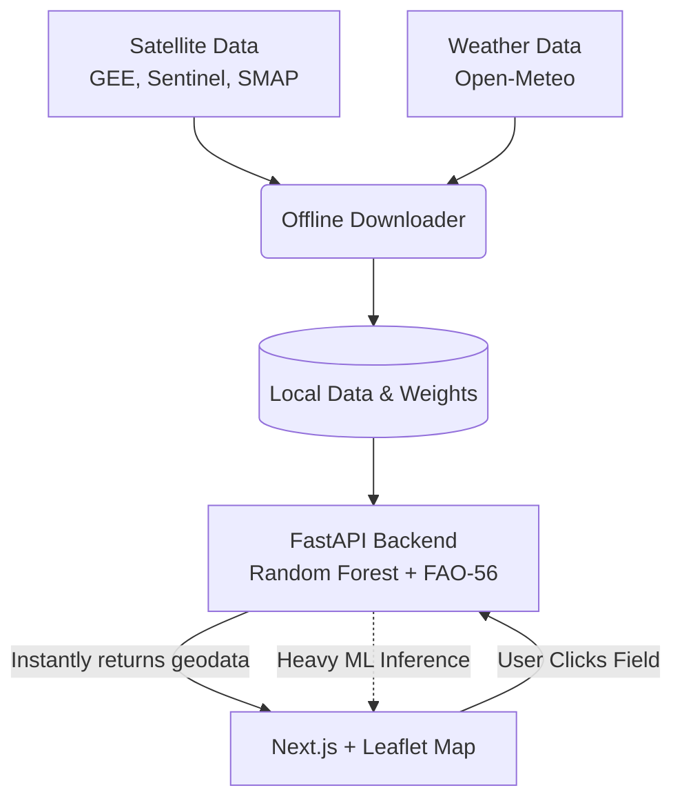

<div align="center">
  <h1>🌱 AgriSense AI</h1>
  <p><strong>Bharatiya Antariksh Hackathon 2026 | Problem Statement 06</strong></p>
  <p><em>Empowering farmers with AI, multi-modal satellite data, and precision agronomy.</em></p>
  
  
  
  
  
</div>

---

## 👋 Hey there!

Welcome to **AgriSense AI**. We built this platform because monitoring crop health shouldn't require a PhD in remote sensing. By fusing Optical imagery (Sentinel-2), Radar data (Sentinel-1), and Soil Moisture metrics (SMAP), we've created a pipeline that automatically identifies crops and tells you exactly when (and how much) to water them. 

No more guesswork—just pure, data-driven agriculture based on the UN FAO-56 standards.

## ✨ What makes it special?

- **🛰️ Multi-Modal Fusion:** We don't just look at optical greenness (NDVI). We use Cloud-penetrating SAR (Radar) and thermal moisture proxies to get a 360-degree view of the field.
- **💧 FAO-56 Irrigation Engine:** We map the predicted crop to its specific growth stage to calculate the exact Crop Evapotranspiration (ETc) deficit.
- **⚡ Zero N+1 Latency:** Maps should be fast. Our Next.js frontend uses asynchronous lazy-loading to render geometries instantly in O(1) time, only fetching heavy ML analysis when a user actively interacts with a field.
- **🤖 Built-in Resilience:** Failsafes are built in. If Google Earth Engine hits a rate limit, our local fallback data kicks in automatically so the dashboard never goes down during a demo.

## 🏗️ Architecture Under the Hood

Here's how the magic happens:



## 🚀 Getting Started

Want to spin this up locally? It takes less than 3 minutes.

### 1. The Brains (Backend)
```bash
# Clone the repo and step inside
git clone https://github.com/Mohit-07-delta/PS-06-Bharatiya-Antariksh-Hackathon-2026.git
cd PS-06-Bharatiya-Antariksh-Hackathon-2026

# Set up your virtual environment
python -m venv venv
.\venv\Scripts\activate      # On Windows
# source venv/bin/activate   # On Mac/Linux

# Install the magic
pip install -r requirements.txt

# Start the API
uvicorn main:app --port 8000 --reload
```

### 2. The Beauty (Frontend)
Open a new terminal window in the same folder:
```bash
npm install
npm run dev
```
🎉 Boom! You're live at `http://localhost:3000`.

## 🧪 Running the Test Suite
We care about reliable code. To verify the endpoints and our anti-latency mechanisms:
```bash
pip install pytest httpx
pytest test_api.py -v
```

## 📡 The Data Stack

We heavily rely on open-source space data:
* **Optical:** Sentinel-2 (NDVI, NDWI)
* **Radar:** Sentinel-1 (SAR VV/VH)
* **Moisture:** NASA SMAP
* **Weather:** Open-Meteo

## 🔮 What's Next?
While our Random Forest baseline is robust, our immediate next step is swapping it out for a spatial CNN (using the PyTorch `ResNet18` weights we've already pipelined) to catch intricate field geometries.

---
<div align="center">
  <p>Built with ❤️ and ☕ for the <b>Bharatiya Antariksh Hackathon 2026</b>.</p>
</div>
